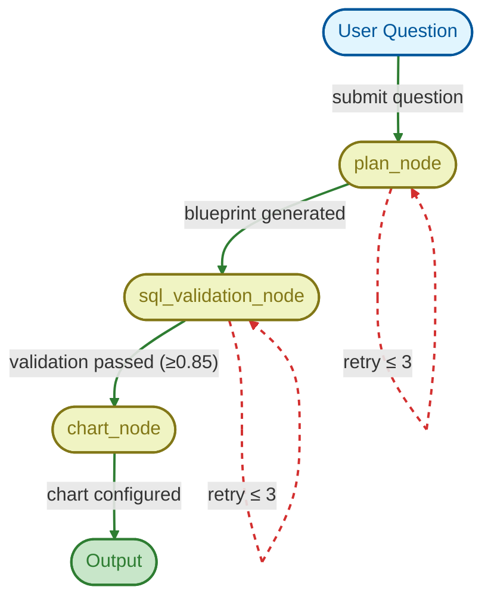

# CLAUDE.md

This file provides guidance to Claude Code (claude.ai/code) when working with code in this repository.

## Common Development Commands

- `uv sync` - Install dependencies
- `uv run python main.py` - Start development server (uvicorn)
- `uv run fastapi dev main.py` - Start FastAPI dev server

## High-Level Architecture

This is a **FastAPI application** that uses **LangGraph** to build an AI agent for natural language to SQL + visualization. The agent converts user questions into SQL queries and generates chart configurations.

### Core Components

**`agent/` - LangGraph Agent System**

- `graph.py` - Compiles the agent graph with MemorySaver checkpointer; exposes `run_agent()` entrypoint
- `nodes.py` - Three nodes: `plan_node`, `sql_validation_node`, `chart_node`
- `states.py` - Pydantic models: `GraphState`, `AgentInput`, `AgentOutput`, `ChartConfig`, `ValidationResult`
- `prompts.py` - LLM prompts for planner, validator, and chart selection
- `deps.py` - `DependencyFactory` with cached database handler instances
- `llm.py` - LLM wrappers: `LLMPlanner`, `LLMValidator`, `LLMChart`

**`database/` - Database Layer**

- `db.py` - `DatabaseHandler` class using SQLAlchemy for schema introspection, SQL generation from blueprints, query execution
- `schemas.py` - Pydantic models: `DatabaseCredential`, `SQLBlueprint`, `TableSchema`, `ColumnRef`, `Metric`, `Filter`, `OrderBy`
- `__init__.py` - Exports `DatabaseHandler` and `DatabaseCredential`

**`main.py`** - FastAPI app with CORS middleware, root and health endpoints

**`langgraph.json`** - Configuration for LangGraph CLI: defines `sql_chart_builder` graph and `run_agent` entrypoint

### Agent Flow

1. **Plan Node**: LLM generates `SQLBlueprint` (dimensions, metrics, filters, order_by, limit) from natural language + DB schema
2. **SQL Validation Node**: Compiles blueprint to SQLAlchemy, runs 10-row preview, LLM validates with confidence scoring (threshold ≥ 0.85)
3. **Chart Node**: Rule-based chart selection first (time series → area/line, categorical → bar/pie, numeric pairs → scatter), LLM fallback

## Key Patterns

- **State Management**: `GraphState` carries `question`, `sql_blueprint`, `sql`, `preview`, `db_schema`, `chart_config`, `error`, `retry_count` through the graph
- **Dependency Injection**: `DependencyFactory` passed via `config.configurable["deps"]`, database credentials via `config.configurable["db_config"]`
- **Caching**: `DatabaseHandler` instances cached via `lru_cache` in `deps.py`
- **Schema Introspection**: `DatabaseHandler.get_schema()` returns `list[TableSchema]` with inferred types (numeric, category, time, text)
- **SQL Blueprint Pattern**: AI generates structured `SQLBlueprint` → `DatabaseHandler.generate_sql_query()` converts to SQLAlchemy `Select`

## Database Support

- **PostgreSQL**, **MySQL**, **SQLite** via SQLAlchemy
- `DatabaseCredential` uses `SecretStr` for passwords
- Network databases require `host` + `port`; SQLite must not have them
- Query parameters supported via `QueryParam` tuple

## Development Notes

- Requires Python ≥ 3.14
- LLM providers via `langchain-groq` (configured in `agent/llm.py`)
- Visualization uses Plotly (chart config only; rendering elsewhere)
- `.env` file required at project root (loaded in `graph.py`)
- `pyproject.toml` uses hatchling build system; packages: `agent`, `database`
