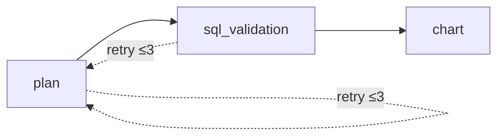

# CLAUDE.md

This file provides guidance to Claude Code (claude.ai/code) when working with code in this repository.

## Project Overview

TableauKnockoff is a FastAPI application that converts natural language questions into SQL queries and chart visualizations using LLMs (via Groq) and LangGraph for agent orchestration.

## Commands

```bash
# Install dependencies (includes dev dependencies)
uv sync --dev

# Run development server
uv run python main.py

# Run all tests
uv run pytest -q --tb=short --no-header

# Run a single test
uv run pytest tests/test_agent.py::TestAgent::test_plan_node_success -v

# Format code
uv run black .

# Run pre-commit hooks
uv run pre-commit run --all-files
```

## Architecture

### Agent Flow (LangGraph)

The core is a 3-node LangGraph agent in `agent/graph.py`:



1. **plan_node** (`agent/nodes.py`): LLM generates `SQLBlueprint` (structured query plan) from the user's question and database schema
2. **sql_validation_node**: Validates the compiled SQL query using LLM; if confidence < 0.85 or invalid, routes back to plan (up to 3 retries)
3. **chart_node**: Generates `ChartConfig` using rule-based heuristics first (`_rule_based_chart`), falls back to LLM if heuristics don't match

The agent state (`agent/states.py`) flows: `GraphState` → `AgentOutput` with fields for `sql_blueprint`, `sql`, `preview`, `chart_config`, and `error`.

### Key Modules

- **`agent/`**: LangGraph agent with LLM interactions via LangChain/Groq
  - `llm.py`: `LLMPlanner`, `LLMValidator`, `LLMChart` - all use `ChatGroq` with `openai/gpt-oss-120b` model
  - `prompts.py`: Prompt templates for each LLM task
  - `deps.py`: `DependencyFactory` for managing dependencies during agent execution
- **`database/`**: SQLAlchemy-based database abstraction
  - `db.py`: `DatabaseHandler` - connects, reflects schema, generates SQL from `SQLBlueprint`, executes queries
  - `schemas.py`: Pydantic models for `SQLBlueprint`, `DatabaseCredential`, `TableSchema`, etc.
- **`web/`**: FastAPI routes
  - `api.py`: `/api/submit_question` and `/api/get_chart_data` endpoints (protected by X-API-KEY header)
  - `ui.py`: FastUI routes at `/ui`
- **`config/`**: Settings via pydantic-settings with `.env` file support

### Database Support

Supports PostgreSQL, MySQL, and SQLite via SQLAlchemy. Connection config uses nested env vars with `__` delimiter (e.g., `DB__TYPE`, `DB__NAME`).

### API Authentication

All `/api/*` endpoints require `X-API-KEY` header matching `INTERNAL_API_KEY` env var.

## Environment Variables

Required in `.env` (see `.env` for example, already gitignored):

- `GROQ_API_KEY` - Groq API access
- `INTERNAL_API_KEY` - API authentication
- `DB__TYPE`, `DB__NAME`, `DB__USERNAME`, `DB__PASSWORD`, `DB__HOST`, `DB__PORT` - Database credentials (only for testing `agent/graph.py`)

Optional LangSmith tracing: `LANGSMITH__API_KEY`, `LANGSMITH__PROJECT`, etc.

## Technical Notes

- **Python 3.14** required (very recent)
- LLM responses use `response_format: {"type": "json_object"}` with structured output via `with_structured_output`
- Chart type selection: `bar`, `line`, `scatter`, `pie`, `area` - rule-based first, then LLM fallback
- SQL blueprint uses `ColumnRef` objects (table + column) throughout - never plain strings
- Pre-commit hooks run: trailing-whitespace, end-of-file-fixer, check-yaml, check-toml, black, basedpyright, uv-lock, and pytest
