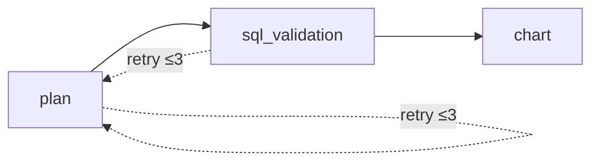

# TableauKnockoff

A FastAPI application that converts natural language questions into SQL queries and chart visualizations using LLMs (via Groq) and LangGraph for agent orchestration.

## Features

- **Natural Language to SQL**: Ask questions in plain English, get SQL queries generated automatically
- **Automatic Chart Generation**: Visualize query results with automatically selected chart types (bar, line, scatter, pie, area)
- **Multi-Database Support**: Works with PostgreSQL, MySQL, and SQLite
- **Agent-Based Architecture**: Uses LangGraph to orchestrate a 3-node LLM agent pipeline
- **SQL Validation**: Built-in validation with retry logic (up to 3 attempts) for generated SQL
- **Modern UI**: FastUI-based web interface for interactive querying

## Architecture

### Agent Flow

The core is a LangGraph agent with three nodes that process queries sequentially:



1. **Plan Node**: LLM generates a `SQLBlueprint` (structured query plan) from the user's question and database schema
2. **SQL Validation Node**: Validates the compiled SQL query using LLM; if confidence < 0.85 or invalid, routes back to plan (up to 3 retries)
3. **Chart Node**: Generates `ChartConfig` using rule-based heuristics first, falls back to LLM if heuristics don't match

### Project Structure

```plaintext
tableauknockoff/
├── agent/              # LangGraph agent with LLM interactions
│   ├── graph.py        # Agent graph definition and compilation
│   ├── nodes.py        # Agent node implementations
│   ├── llm.py          # LLM wrappers (Planner, Validator, Chart)
│   ├── prompts.py      # Prompt templates for LLM tasks
│   ├── states.py       # Agent state definitions
│   └── deps.py         # Dependency management
├── database/           # Database abstraction layer
│   ├── db.py           # DatabaseHandler for connections and queries
│   └── schemas.py      # Pydantic models for DB schemas
├── web/                # FastAPI routes
│   ├── api.py          # API endpoints
│   └── ui.py           # FastUI routes
├── config/             # Configuration
│   └── settings.py     # Pydantic-settings with .env support
├── tests/              # Test suite
└── main.py             # Application entry point
```

## Installation

### Prerequisites

- Python 3.13+
- [uv](https://github.com/astral-sh/uv) package manager

### Setup

1. Clone the repository:

   ```bash
   git clone https://github.com/froggobytes0460/TableauKnockoff.git
   cd TableauKnockoff
   ```

2. Install dependencies:

   ```bash
   uv sync --dev
   ```

3. Create a `.env` file with required environment variables (see Configuration below)

## Configuration

Create a `.env` file in the project root with the following variables:

```env
# Required
GROQ_API_KEY=your_groq_api_key
INTERNAL_API_KEY=your_api_key_for_auth

# Database Configuration (for testing)
DB__TYPE=postgresql  # or mysql, sqlite
DB__NAME=your_db_name
DB__USERNAME=your_username
DB__PASSWORD=your_password
DB__HOST=localhost
DB__PORT=5432

# Optional: LangSmith Tracing
LANGSMITH_API_KEY=your_langsmith_key
LANGSMITH_PROJECT=your_project_name
```

## Usage

### Running the Development Server

```bash
uv run python main.py
```

Or with uvicorn directly:

```bash
uv run uvicorn main:app --reload --host 0.0.0.0 --port 8000
```

### API Endpoints

#### POST `/api/submit_question`

Submit a natural language question for processing.

**Headers:**

- `X-API-KEY`: Your API key for authentication

**Request Body:**

```json
{
  "question": "What are the total sales per store?",
  "db_config": {
    "db_type": "postgresql",
    "database": "my_db",
    "username": "user",
    "password": "pass",
    "host": "localhost",
    "port": 5432
  }
}
```

**Response:**

```json
{
  "sql_blueprint": { ... },
  "sql": "SELECT store_id, SUM(sales) FROM ...",
  "preview": [ ... ],
  "chart_config": { ... },
  "error": null
}
```

#### POST `/api/get_chart_data`

Execute a SQL query and return results for charting.

**Headers:**

- `X-API-KEY`: Your API key for authentication

#### GET `/health`

Health check endpoint.

### Web UI

Access the FastUI interface at `http://localhost:8000/ui`

## Development

### Running Tests

```bash
uv run pytest -q --tb=short --no-header
```

Run a specific test:

```bash
uv run pytest tests/test_agent.py::TestAgent::test_plan_node_success -v
```

### Code Formatting

```bash
uv run black .
```

### Type Checking

```bash
uv run basedpyright
```

### Pre-commit Hooks

The project uses pre-commit hooks for code quality. Run them manually:

```bash
uv run pre-commit run --all-files
```

Or install them to run automatically on commit:

```bash
uv run pre-commit install
```

## Technologies

- **FastAPI**: Web framework
- **LangGraph**: Agent orchestration
- **LangChain + Groq**: LLM integration (using `openai/gpt-oss-120b` model)
- **SQLAlchemy**: Database abstraction
- **FastUI**: Modern web UI framework
- **Pydantic**: Data validation and settings management
- **Plotly**: Chart rendering

## Author

FroggoBytes
